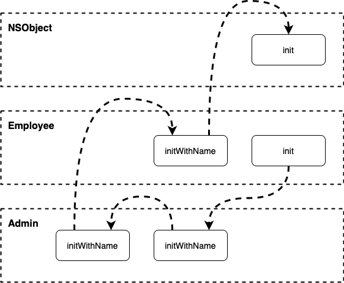

# Objective-C Initializers

This repository demonstrates how initializers work in Objective-C. 

## Introduction

Initializers are special methods that prepare an instance of a class for use. In Objective-C, the `NSObject` class is the root class from which most other classes inherit. This means that understanding how to initialize instances of a class, starting from `NSObject`, is fundamental to working with Objective-C.

## Subclassing and Initializers

The diagram below demonstrates a sequence of instance initialization calls for the following use case: 

```objc
Admin *testAdmin = [[Admin alloc] init];
```

<br />
<p align="center">
    
</p>
